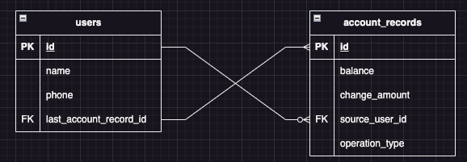

# JDBC 실습 - [스프링 DB 1편](https://www.inflearn.com/course/%EC%8A%A4%ED%94%84%EB%A7%81-db-1)

# 공부할 내용

- 최적의 JDBC 세팅
- JDBC MySQl 적용

# 기능

- 사용자는 이름, 전화번호를 가지고 있다.
- 사용자의 전화번호는 중복 될 수 없다.
- 사용자는 입금 할 수 있다.
- 사용자는 출급 할 수 있다.
- 사용자간 이체 할 수 있다.

# ERD

